# Statisztika a közösségi média használatból

Forrása az adathalmaznak: https://www.kaggle.com/datasets/imyjoshua/average-time-spent-by-a-user-on-social-media?resource=download

## Leíró statisztika

Forráskód: [1_leiro.r](1_leiro.r)

### Kvantitatív összegzés

|                   |  Kor   | Eltöltött idő (óra/nap) | Bevétel (USD) |
| ----------------: | :----: | :---------------------: | :-----------: |
|           Minimum | 18.000 |          1.000          |   10012.00    |
|           Maximum | 64.000 |          9.000          |   19980.00    |
|             Átlag | 40.986 |          5.029          |   15014.82    |
|          Q1 (25%) | 29.000 |          3.000          |   12402.25    |
| Medián / Q2 (50%) | 42.000 |          5.000          |   14904.50    |
|          Q3 (75%) | 52.000 |          7.000          |   17674.25    |

#### Boxplotok

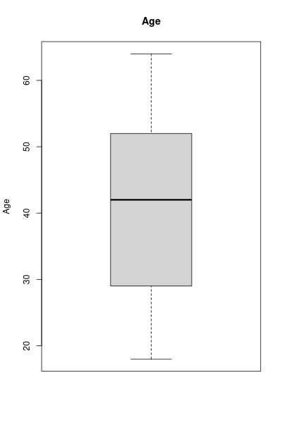
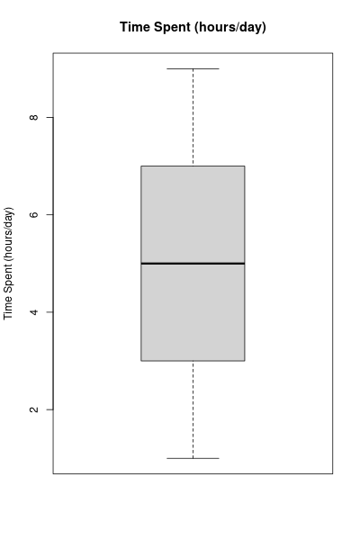
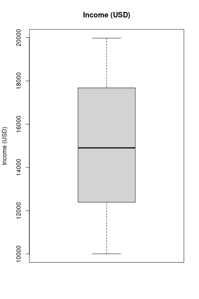

### Kvalitatív összegzés

#### Nem / Közösségi Média Platform

|             | Facebook | Instagram | YouTube |
| ----------: | :------: | :-------: | :-----: |
|          Nő |    85    |    135    |   111   |
|       Férfi |   113    |    128    |   96    |
| Nem-Bináris |   109    |    100    |   123   |

#### Hisztogrammok

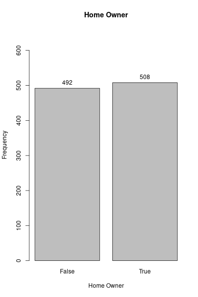
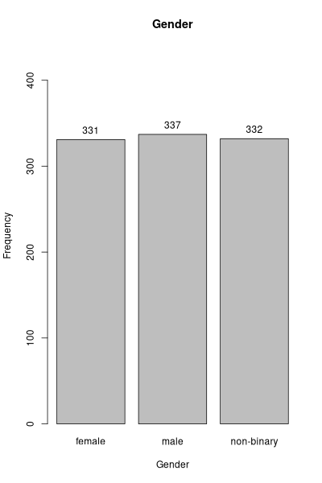
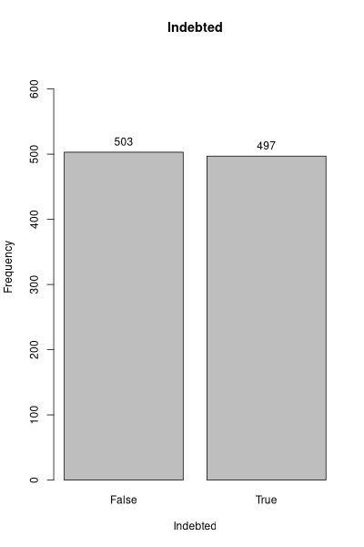
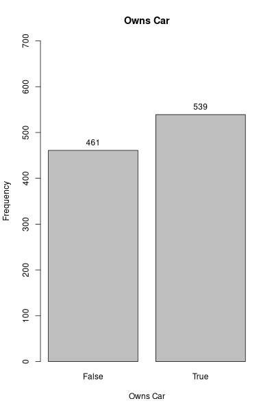
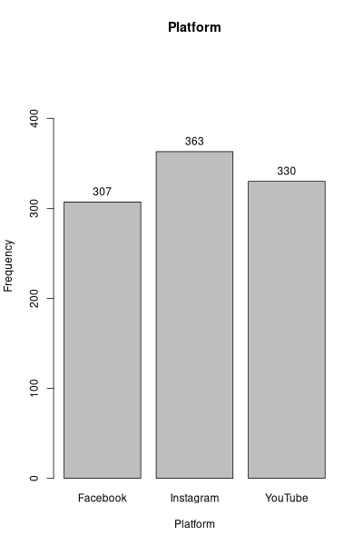

## 2. Közösségi médián töltött idő férfiak és nők között (kétmintás t-próba)

Forráskód: [2_t_proba.r](2_t_proba.r)

### Átlagos eltöltött idő

- **Férfiaknál**: 4.821958
- **Nőnél**: 5.190332

### Null-hipotézis (H0)

Nincs jelentős különbség az átlagos időtöltésben a férfiak és nők között.

`H₀: μ_férfi = μ_nő`, ahol `μ` az átlagot jelöli.

#### Null-hipotézis eredménye

```
t = -1.8618
df = 665.24
p-value = 0.06307
```

Mivel a p-érték 0.05-nől nagyobb, ezért nem tudjuk elutasítani a null-hipotézist. Esetleg azt az alternatív hipotézist megfogalmazhatjuk:

#### Alternatív hipotézis (H1)

Van jelentős különbség az átlagos időtöltésben a férfiak és nők között.

Azonban ezt a próba ténylgesen nem bizonyítja.

## 3. A nem és platform változók összefüggése (Chi négyzet próba)

Forráskód: [3_khi_negyzet_proba.r](3_khi_negyzet_proba.r)

### Kontingencia tábla nem és platform között:

|             | Facebook | Instagram | YouTube |
| ----------: | :------: | :-------: | :-----: |
|          Nő |    85    |    135    |   111   |
|       Férfi |   113    |    128    |   96    |
| Nem-Bináris |   109    |    100    |   123   |

Khí-négyzet próba eredménye:

```
X-squared = 13.436
df = 4
p-value = 0.009331
```

### Null-hipotézis (H0)

A nem és platform függetlenek egymástól.

#### Null-hipotézis eredménye

A p-érték kisebb, mint 0.05, ezért elutasítjuk a nullhipotézist. Ez miatt biztosra mondható, hogy a nemtől függ milyen platformon töltenek el a felhasználók időt.

## 4. Lineáris regresszió eltöltött időre a bevétel és a kor alapján

Forráskód: [4_lin_regresszio.r](4_lin_regresszio.r)

```
Modell 1: time_spent ~ age

Call:
lm(formula = time_spent ~ age, data = data_set)

Residuals:
    Min      1Q  Median      3Q     Max
-4.1625 -2.0734 -0.0448  2.0220  4.1174

Coefficients:
             Estimate Std. Error t value Pr(>|t|)
(Intercept)  5.289674   0.256660  20.610   <2e-16 ***
age         -0.006360   0.005948  -1.069    0.285
---
Signif. codes:  0 ‘***’ 0.001 ‘**’ 0.01 ‘*’ 0.05 ‘.’ 0.1 ‘ ’ 1

Residual standard error: 2.538 on 998 degrees of freedom
Multiple R-squared:  0.001144,  Adjusted R-squared:  0.0001434
F-statistic: 1.143 on 1 and 998 DF,  p-value: 0.2852

R-squared: 0.001144263
AIC: 4704.353

Modell 2: time_spent ~ income

Call:
lm(formula = time_spent ~ income, data = data_set)

Residuals:
    Min      1Q  Median      3Q     Max
-4.0492 -2.0372 -0.0258  1.9796  3.9914

Coefficients:
             Estimate Std. Error t value Pr(>|t|)
(Intercept) 4.968e+00  4.155e-01   11.96   <2e-16 ***
income      4.081e-06  2.715e-05    0.15    0.881
---
Signif. codes:  0 ‘***’ 0.001 ‘**’ 0.01 ‘*’ 0.05 ‘.’ 0.1 ‘ ’ 1

Residual standard error: 2.539 on 998 degrees of freedom
Multiple R-squared:  2.263e-05, Adjusted R-squared:  -0.0009793
F-statistic: 0.02259 on 1 and 998 DF,  p-value: 0.8806

R-squared: 2.263144e-05
AIC: 4705.476

Modell 3: time_spent ~ age + income

Call:
lm(formula = time_spent ~ age + income, data = data_set)

Residuals:
    Min      1Q  Median      3Q     Max
-4.1695 -2.0736 -0.0454  2.0194  4.1224

Coefficients:
              Estimate Std. Error t value Pr(>|t|)
(Intercept)  5.265e+00  5.014e-01  10.501   <2e-16 ***
age         -6.330e-03  5.974e-03  -1.060    0.290
income       1.557e-06  2.725e-05   0.057    0.954
---
Signif. codes:  0 ‘***’ 0.001 ‘**’ 0.01 ‘*’ 0.05 ‘.’ 0.1 ‘ ’ 1

Residual standard error: 2.539 on 997 degrees of freedom
Multiple R-squared:  0.001148,  Adjusted R-squared:  -0.0008562
F-statistic: 0.5727 on 2 and 997 DF,  p-value: 0.5642

R-squared: 0.001147532
AIC: 4706.35

Összehasonlítás:
Model 1 R-squared: 0.001144263 AIC: 4704.353
Model 2 R-squared: 2.263144e-05 AIC: 4705.476
Model 3 R-squared: 0.001147532 AIC: 4706.35
```

### Ábrák

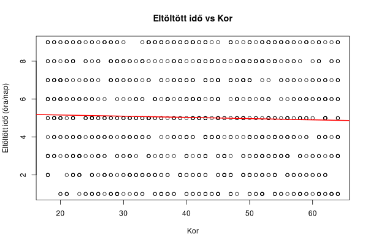
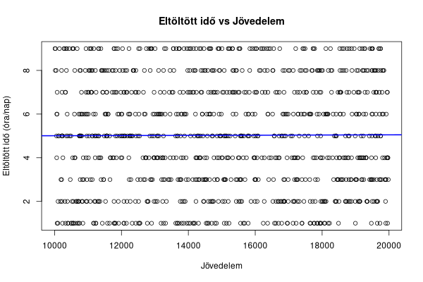
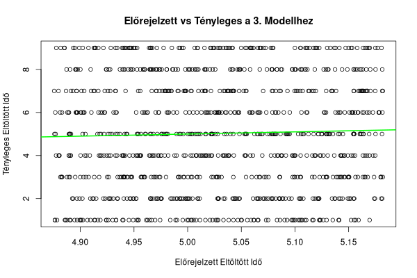

### Legjobb modell?

- R² alapján a harmadik (ez a legnagyobb)
- AIC alapján az első (ez a legkisebb)

## 5. Nemlineáris regresszió a platformon eltöltött idő megbecslésére kor alapján

Forráskód: [5_nemlin_regresszio.r](5_nemlin_regresszio.r)

```
Nemlineáris regresszió modell (kvadratikus):

Call:
lm(formula = time_spent ~ poly(age, 2), data = train_data)

---
Signif. codes:  0 ‘***’ 0.001 ‘**’ 0.01 ‘*’ 0.05 ‘.’ 0.1 ‘ ’ 1

Residual standard error: 2.539 on 996 degrees of freedom
Multiple R-squared:  0.001189,  Adjusted R-squared:  -0.0008168
F-statistic: 0.5928 on 2 and 996 DF,  p-value: 0.553
```

#### Coefficients

|               | Estimate | Std. Error | t value |  Pr(>\|t\|)   |
| ------------: | :------: | :--------: | :-----: | :-----------: |
|   (Intercept) | 5.03103  |  0.08034   | 62.621  | <2e-16 \*\*\* |
| poly(age, 2)1 | -2.64353 |  2.53933   | -1.041  |     0.298     |
| poly(age, 2)2 | -0.81012 |  2.53933   | -0.319  |     0.750     |

#### Residuals

|   Min   |   1Q    | Median  |   3Q   |  Max   |
| :-----: | :-----: | :-----: | :----: | :----: |
| -4.1236 | -2.0953 | -0.0707 | 2.0015 | 4.1672 |

#### Predikció

- Tényleges érték: 3
- Előrejelzett érték: 4.92974
- Abszolút eltérés: 1.92974

### Ábra

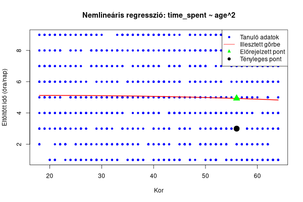

## 6. Faktor analízis

Forráskód: [6_faktor_analizis.r](6_faktor_analizis.r)

Folytonos változók: kor (age), naponta eltöltött idő órában (time_spent), bevétel USD-ben (income)

### Eredmény

```
Faktor analízis eredménye (1 faktor):

Call:
factanal(x = continuous_vars, factors = 1)

The degrees of freedom for the model is 0 and the fit was 0
```

#### Uniquenesses

|  age  | time_spent | income |
| :---: | :--------: | :----: |
| 0.380 |   0.998    | 0.988  |

#### Loadings

|                | Factor1 |
| -------------: | :-----: |
|            age |  0.787  |
|     time_spent |         |
|         income | -0.111  |
|                |         |
|    SS loadings |  0.634  |
| Proportion Var |  0.211  |

#### Faktor loadings

|    age     | time_spent  |   income    |
| :--------: | :---------: | :---------: |
| 0.78727289 | -0.04296642 | -0.11100467 |

### Értelmezés

Ha az érték 0.5 felett van, akkor jól magyarázza

- Kor: jól magyarázza
- Eltöltött idő: rosszul magyarázza
- Jövedelem: rosszul magyarázza

### Ábra

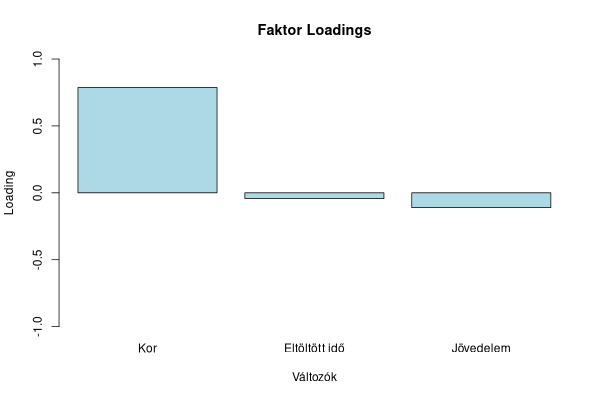

## 7. K-means-szel osztályozni az eltöltött időt (óra/nap) kor alapján

### Output

```
Automatikusan kiválasztott optimális klaszterek száma: k = 9 (ahol a hiba csökkenése lelassul)

K-means klaszterezés eredménye (k = 9 ):

A csoportok átlagos értékei (középpontok):
       age time_spent
1 43.76000   4.456000
2 39.11321   6.273585
3 53.73529   7.823529
4 33.53043   4.460870
5 49.07547   5.018868
6 20.57931   5.365517
7 27.21094   4.781250
8 55.27473   2.879121
9 61.73276   4.982759

Minden csoportba hány pont tartozik:
[1] 125 106  68 115 106 145 128  91 116
Összes hiba a csoportosításban: 8329.838 (alacsonyabb = jobb)
```

### Ábrák

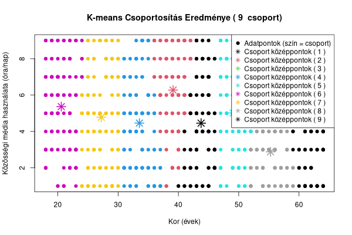
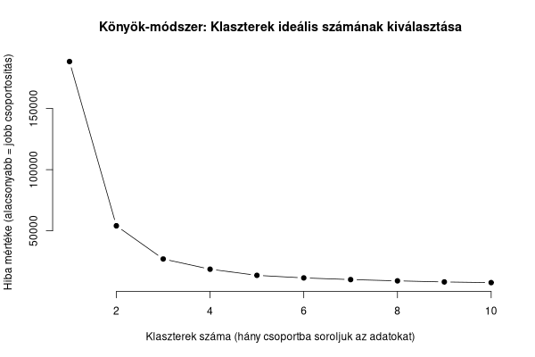
